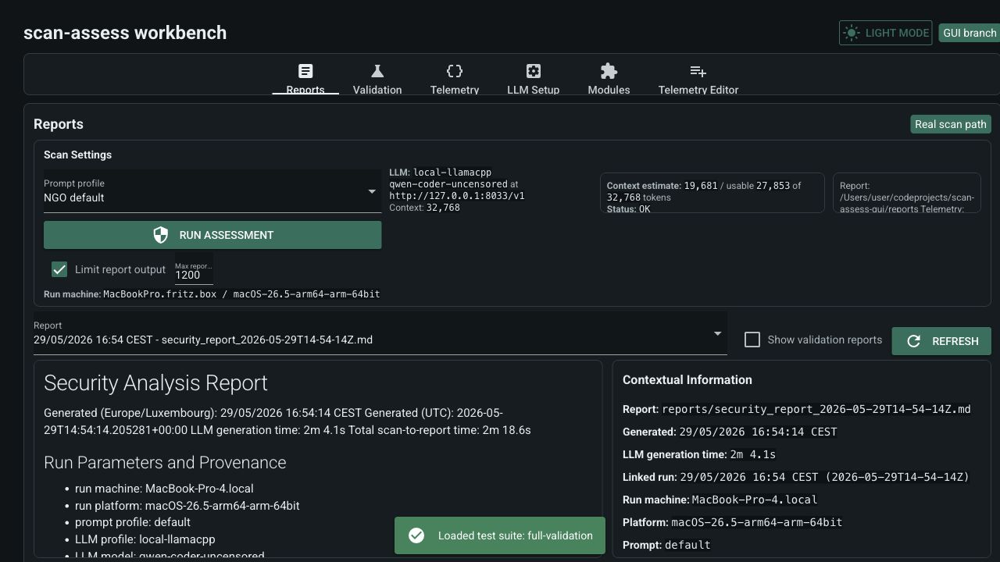
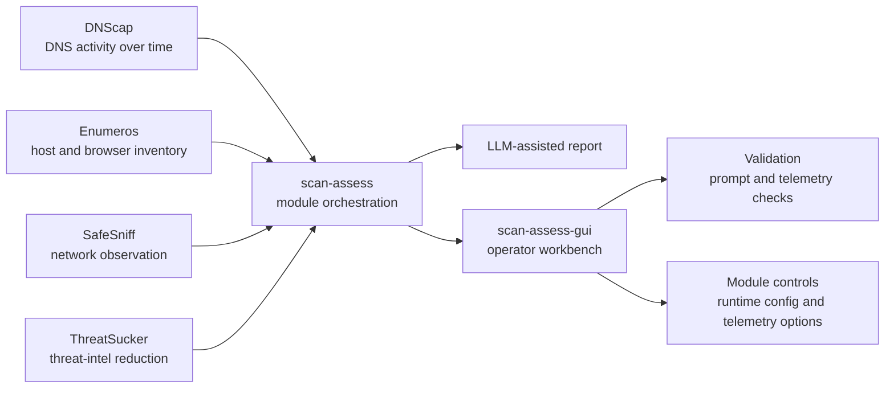

# scan-assess-gui

GUI-first workbench for a modular defensive telemetry suite.

scan-assess-gui runs small, inspectable security telemetry modules, gathers their JSON outputs, and uses a local or OpenAI-compatible LLM endpoint to produce an operator-friendly Markdown report. The goal is not to hide decisions inside an LLM: the telemetry remains module-owned, structured, and reviewable.

## Visual Preview



## Joined-Up Telemetry Model

The project is built around independently useful modules that can also plug into scan-assess:



Each module owns its collection logic and runtime configuration. scan-assess consumes the resulting telemetry, records provenance, and assembles the report context. scan-assess-gui adds the visual workflow: run controls, prompt profiles, LLM profiles, module toggles, telemetry browsing, and validation.

## Module Roles

- `modules/dnscap`: DNS telemetry importer for DNScap/dnslog-agent logs. DNScap is a standalone Rust collector with multi-platform binaries; the scan-assess wrapper imports a selected time window.
- `modules/enumeros`: lightweight host, OS, and browser inventory telemetry. Enumeros is a standalone Rust inventory collector that can also feed scan-assess.
- `modules/safesniff`: owner-authorised network observation and safe service-enumeration telemetry. SafeSniff is a standalone Rust tool with platform-specific binaries and a scan-assess wrapper.
- `modules/threatsucker`: explainable threat-intelligence collection, reduction, scoring, and correlation for small NGOs. ThreatSucker is a standalone Python project with CLI and web controls.

The shared pattern is:

```text
standalone tool -> JSON telemetry -> scan-assess runner -> report context -> GUI review/validation
```

## Why This Exists

Small organisations often need practical defensive visibility without a heavy SIEM, cloud dependency, or opaque AI workflow. This project keeps the pieces simple:

- Rust collectors where platform-specific local telemetry matters.
- Python wrappers where orchestration, configuration, and inspectability matter.
- JSON telemetry as the integration contract.
- Local LLM support so reports can be generated without sending sensitive telemetry to a third party.
- Validation telemetry so prompts can be tested against known positive and benign cases.

## Run The LLM Server

Optionally, with llama.cpp, in one terminal:

```bash
./launch_llama.sh
```

The scanner expects an OpenAI-compatible endpoint at:

```text
http://localhost:8033/v1
```

## Run scan-assess

Install dependencies:

```bash
uv sync
```

Official/live path:

```bash
uv run python main.py --live
```

Demo path, including the bundled phishing-DNS scenario and demo ThreatSucker intel:

```bash
uv run python main.py --demo
```

DNScap log folders and time windows are configured inside the DNScap module:

```text
modules/dnscap/config/scan_assess_runtime.json
```

The DNScap wrapper imports stored collector logs for the configured window, such as all logs, last week/month/year, since the previous successful scan-assess DNScap import, or a custom date range.

Select a model endpoint/profile:

```bash
uv run python main.py --live --llm-profile local-llamacpp
```

Reports are written to `reports/`. Module outputs are written to `outputs/`.

## Run The GUI Workbench

```bash
uv run python -m src.gui_app
```

Open:

```text
http://127.0.0.1:8088
```

The GUI workbench provides assessment launching, output location preview, prompt-profile editing, prompt validation, LLM-profile selection, detected-module enable/disable switches, a first-class Reports view, report-to-telemetry links, and a module-folder Telemetry browser with beautified JSON/JSONL/text viewing.

Prompt and report checks live in the **Validation** tab. That view puts the selected prompt, background telemetry, per-module telemetry choices, LLM output, and the run-again button in one workflow. Module choices regenerate the JSON payload, and the generated telemetry can be edited in the Telemetry Editor when needed.

The left sidebar keeps assessment setup folded away by default. Open **Run setup** to choose or edit the prompt profile and LLM profile, including the model name, OpenAI-compatible base URL, API-key environment variable, and description.

When a run completes, module telemetry appears under:

```text
outputs/<run>/<module>/
```

The matching Markdown report appears under:

```text
reports/security_report_<run>.md
```

Prompt profiles live in `config/prompt_profiles/`. LLM profiles live in `config/llm_profiles/`. Module runtime config lives under each module's own `config/` directory where that module needs it.

## ThreatSucker UI

```bash
cd modules/threatsucker/source
uv run threatsucker web --host 127.0.0.1 --port 8765
```

Open:

```text
http://127.0.0.1:8765/config
```

The config UI provides source toggles, source import, scoring sliders, YAML validation, and raw YAML editing.

## Safety Notes

- Bundled phishing DNS logs are only used by `--demo` or when configured in `modules/dnscap/config/scan_assess_runtime.json`.
- Bundled demo ThreatSucker intel is excluded from official scan-assess runner workspaces unless `--demo` is used or `modules/threatsucker/config/scan_assess_runtime.json` enables it.
- Prompting is provenance-aware: sample/demo data is excluded from action items, imported DNS logs are treated as historical observations, and SafeSniff target detection is not described as a TCP service scan.
